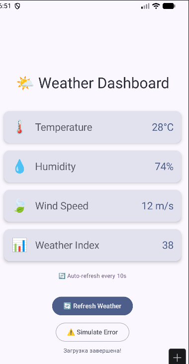
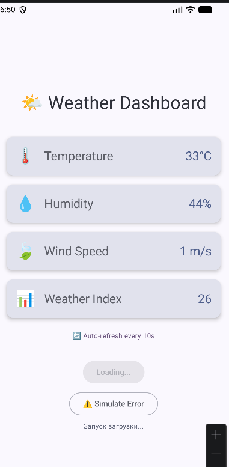
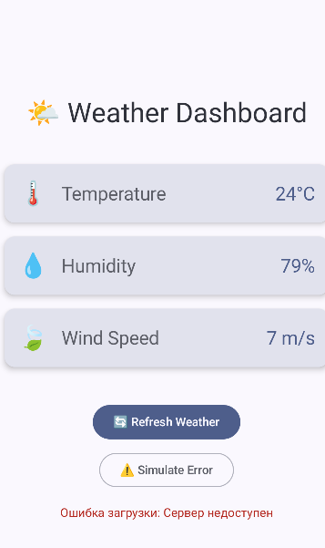

# Weather Dashboard

## Краткое описание
Android-приложение, демонстрирующее практическое применение корутин в Kotlin для асинхронных операций. Проект показывает разницу между последовательной и параллельной загрузкой данных, работу с разными диспетчерами и корректную обработку ошибок без блокировки UI-потока.

## Функциональность приложения
- Отображение погоды по четырём параметрам: температура, влажность, скорость ветра и погодным индексом
- Индикатор загрузки 
- Кнопка ручного обновления данных
- Параллельная загрузка данных с использованием `async` и `await`
- Имитация ошибок сети и безопасная обработка исключений
- Автоматическое обновление данных каждые 10 секунд
- Демонстрация переключения между диспетчерами для вычислений

## Технологии и библиотеки
- Kotlin
- Jetpack Compose (Material 3)
- Kotlin Coroutines (`kotlinx-coroutines-core`, `kotlinx-coroutines-android`)
- Android ViewModel (`lifecycle-viewmodel-compose`)
- StateFlow / MutableStateFlow
- Git

## Контрольные вопросы

### A) В чём разница между `launch` и `async`?
`launch` запускает корутину и не возвращает результат (возвращает `Job`). Используется для выполнения фоновых задач, результат которых не требуется. `async` запускает корутину и возвращает `Deferred<T>`, позволяя получить результат через `.await()`.

### B) Что такое suspend функция?
`suspend` функция может приостанавливать и возобновлять выполнение, не блокируя поток. Её нельзя вызывать из обычной функции напрямую — только из другой `suspend` функции или корутины. `delay()` не блокирует поток, так как приостанавливает только текущую корутину, освобождая поток для выполнения других задач, в отличие от `Thread.sleep()`.

### C) Зачем нужны разные диспетчеры?
Диспетчеры определяют, в каком потоке будет выполняться корутина, чтобы распределять нагрузку и не блокировать UI.

| Dispatcher | Пример задач |
|---|---|
| Main | Обновление интерфейса, работа с View/Compose |
| IO | Сетевые запросы, чтение/запись файлов, БД |
| Default | Тяжёлые вычисления, обработка больших списков |

Если выполнить тяжёлое вычисление на `Dispatchers.Main`, главный поток будет заблокирован, интерфейс приложения зависнет и станет не отвечающим.

### D) Что произойдёт, если не обработать исключение в корутине?
Приложение аварийно завершит работу с ошибкой `FATAL EXCEPTION`. Для корректной обработки ошибок код необходимо оборачивать в `try-catch` или использовать `coroutineScope`. `try-catch` внутри `launch` нужен, чтобы поймать исключения, всплывающие из дочерних корутин, и предотвратить краш, позволяя вывести сообщение об ошибке пользователю.

### E) Как работает автоматическая отмена корутин?
Корутины привязываются к определённой области жизни (Scope). `viewModelScope` — это встроенная область, привязанная к циклу жизни `ViewModel`. Когда `ViewModel` уничтожается (вызывается `onCleared()`), `viewModelScope` автоматически отменяет все запущенные в ней корутины, что предотвращает утечки памяти и фоновые работы после закрытия экрана.

## Как запустить проект
1. Откройте проект в Android Studio и дождитесь синхронизации зависимостей.
2. Выберите эмулятор или подключённое устройство.
3. Нажмите ▶️ Run 'app' для сборки и запуска.

## Скриншоты работы приложения

## Автор и дата выполнения
Автор: Катаржин Г.М.

Дата: 14.04.2026